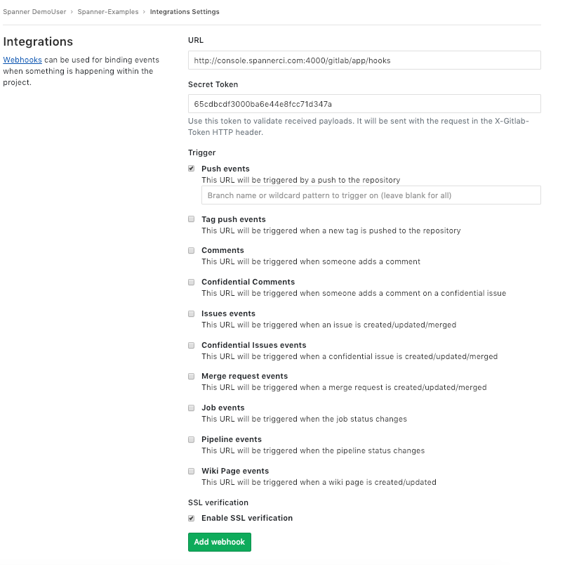

# Spanner CI Integrations #

## Table of Contents
* [Introduction](#introduction)
* [Quick Start Guide](#quick-start-guide)
    * [GitHub integration](#github-integration-through-spanner-ci-official-github-app)
    * [Gitlab Integration](#gitlab-integration-through-webhook)
* [Spanner CI Permission Scopes](#spanner-ci-permission-scopes)

## Introduction
[Spanner CI](https://spannerci.com) integrations gives you and your organization full visibility into your GitHub or Gitlab projects right in Spanner CI Platform, where you can create projects based on your code repositories

This readme contains everything that is needed to get started using Spanner CI integrations. It's highly recommended to use it as a starting point to understand how Spanner CI can be easily integrated with your own Github or Gitlab [ private | public ] repository. More details about this can be found below. Follow the Quick Start Guide to start using Spanner CI Integrations.

## Quick Start Guide

#### GitHub integration (through Spanner CI Official Github App)

* Step 1: If you already have a GitHub account click the `SIGN UP WITH GITHUB` button on the [Spanner CI Platform](https://console-spannerci.com). This will redirect you to GitHub authorisation page:

* Step 2: You will be prompted to give the app access:

* Step 2: Then you'll be automatically sign-in to the Spanner CI Platform where you can fill your organization info

That's the recommended way to sign-up because it doesn't require further actions regarding the Spanner integration with GitHub.

Details about the GitHub integration can be then found under the Integrations page.

#### Gitlab Integration (through Webhook)

* Step 1: If you already have a Gitlab account, go to the [Gitlab Profile Settings](https://gitlab.com/profile/)

* Step 2: Click on Access Token on the Left Sidebar Menu
* Step 3: Give a friendly name to your Access Token and Choose api scope from the checkboxes in order to give access to Spanner CI retrieve your repository info as shown in the above page:

* Step 4: Copy the generated token to your clipboard in order to paste it on Spannner CI Platform

* Step 5: Sign in to [Spanner CI Platform](https://console-spannerci.com)
* Step 6: Click on Integrations on Left Sidebar Menu

* Step 7: Click on Gitlab Integration and wait for a pop-up window with Gitlab Configuration Settings
* Step 8: Once the Pop-Up window is appeared, paste the generated access token from clipboard to the corresponding field in order to give access to Spanner CI retrieve your repository info

Update the access token to Spanner CI platform Integrations as many times as you want.

Do not forget to save your Gitlab access token - you won't be able to access it again.

* Step 9: If you want to trigger Spanner CI on each push / pull request you have to copy the generated Gitlab Webhook Secret Token from Spanner CI (as shown in the above image) and click on Integrations in your Gitlab Project.

* Step 10: Fill the URL with http://console.spannerci.com:4000/gitlab/app/hooks and paste your Webhook Secret Token. Choose Trigger events (Push or/and Merge request events) whenever you want to trigger Spanner CI.

## Spanner CI Permission Scopes

#### GitHub Permission Scopes

|Permission scope|Why we need it|
|---|---|
|Read access to code| To clone repository code in Spanner CI Projects|
|Read and write access to commit statuses, pull requests, and repository hooks | To trigger Spanner CI platform in each pull / push request|
|Read access to metadata and vulnerability alerts | To read repositories's metadata and any alerts|

#### Gitlab Permission Scopes

|Permission scope|Why we need it|
|---|---|
|api| Grants Spanner CI complete read/write access to the API, including all groups and projects.|
